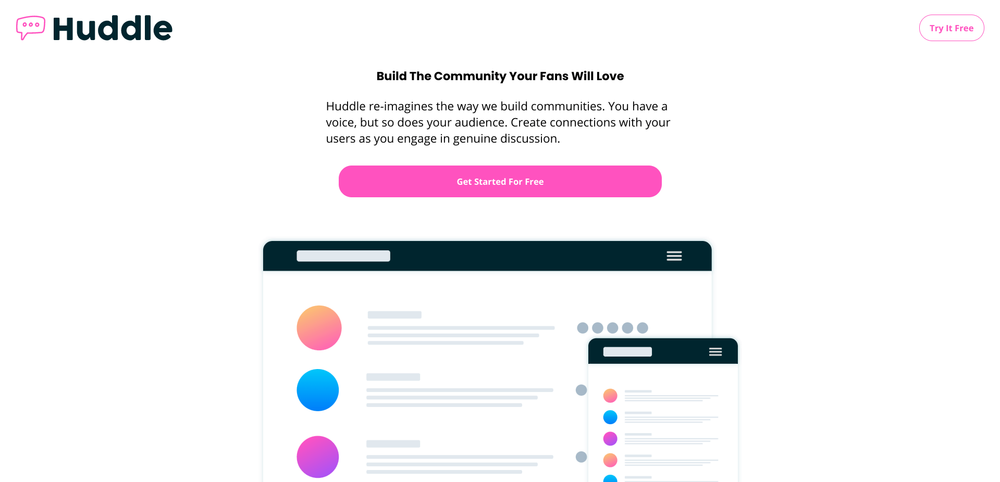

# Frontend Mentor - Huddle landing page with curved sections solution

This is a solution to the [Huddle landing page with curved sections challenge on Frontend Mentor](https://www.frontendmentor.io/challenges/huddle-landing-page-with-curved-sections-5ca5ecd01e82137ec91a50f2). Frontend Mentor challenges help you improve your coding skills by building realistic projects.

## Table of contents

- [Overview](#overview)
  - [The challenge](#the-challenge)
  - [Screenshot](#screenshot)
  - [Links](#links)
- [My process](#my-process)
  - [Built with](#built-with)
  - [What I learned](#what-i-learned)
  - [Continued development](#continued-development)
  - [Useful resources](#useful-resources)

## Overview

### The challenge

Users should be able to:

- View the optimal layout for the site depending on their device's screen size
- See hover states for all interactive elements on the page

### Screenshot

### Links

- Live Site URL: [Github Pages](https://jdegand.github.io/huddle-landing-page-with-curved-sections/)

## My process

### Built with

- CSS custom properties
- Flexbox
- CSS Grid
- Mobile-first workflow

### What I learned

### Continued development

- Semantic HTML

- Should have used the wave as the content of a before instead of an img tag.  The img is not seemless.  You see a line at the bottom of the  image on mobile.

- Srcset for mobile / desktop pictures.

- The light color on the section made it hard to layout.  Should have mocked it out in a darker color.  

- The hover color is off.  Should have used fill?

- Incomplete form.

### Useful resources

- [Font Awesome](https://fontawesome.com/v5.15/icons)
- [Font Awesome](https://fontawesome.com/v5.15/how-to-use/on-the-web/styling/sizing-icons) - Sizing Font Awesome Icons

